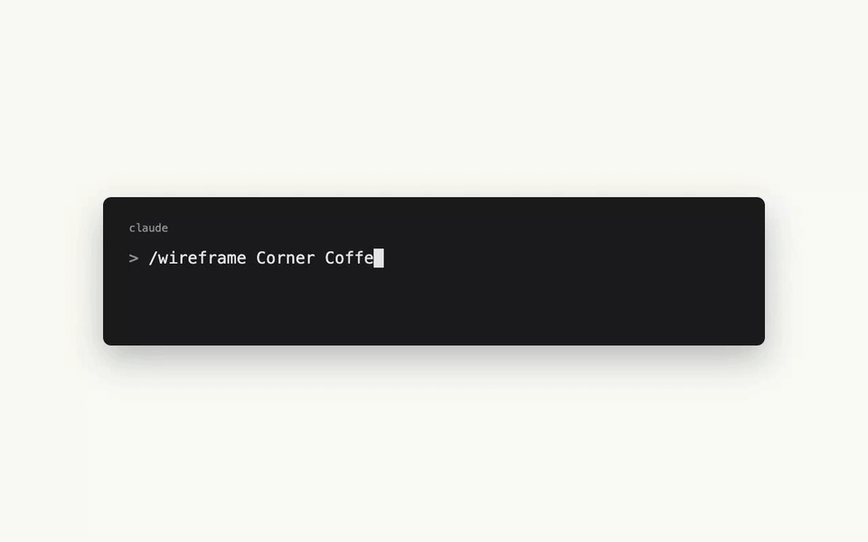
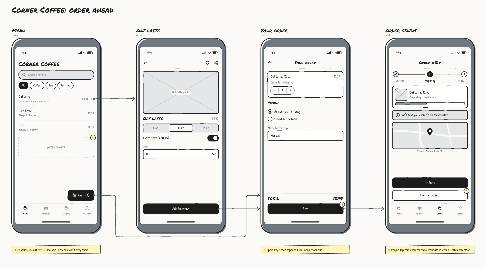
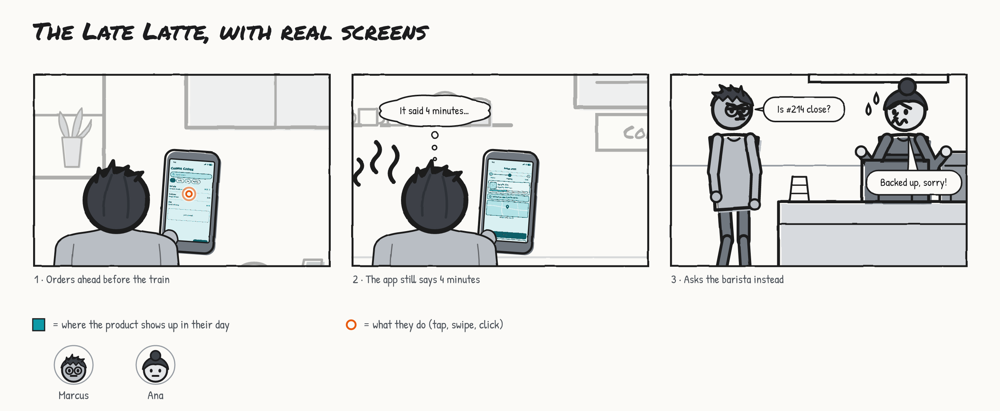
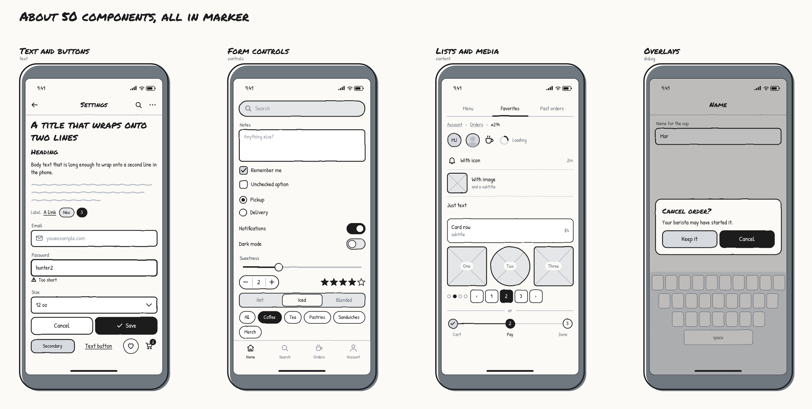
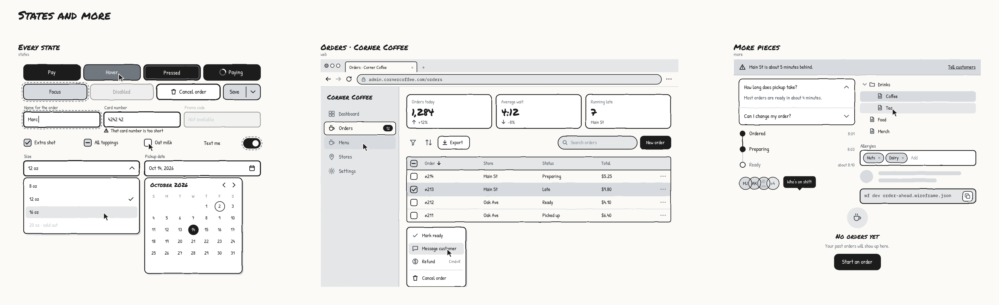
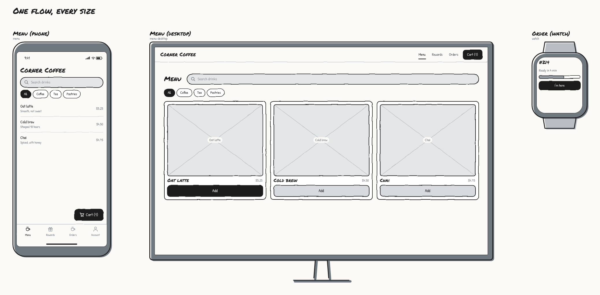
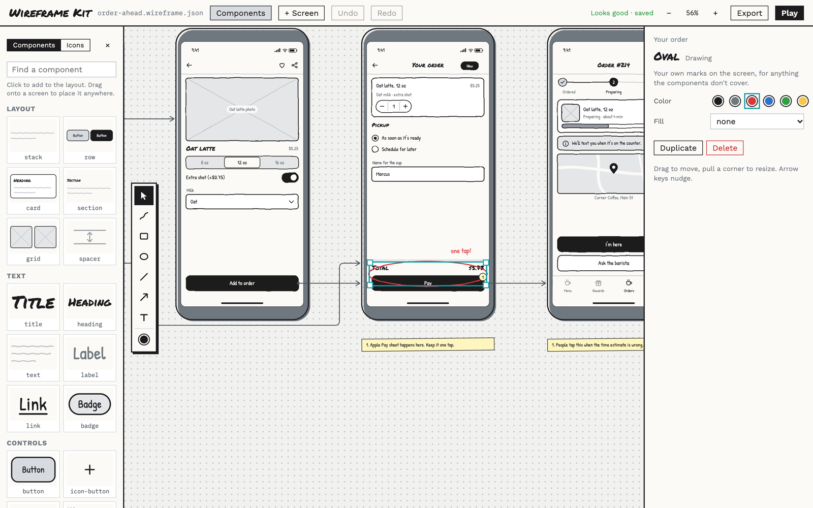
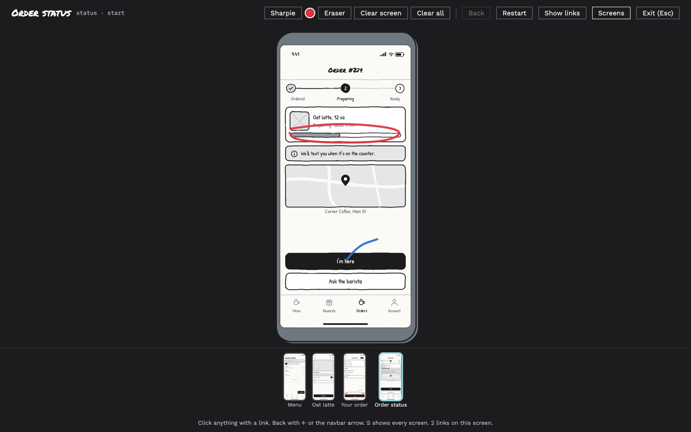

# Wireframe Kit

**Low-fi wireframes and clickable flows, built by your coding agent.**

You tell Claude Code (or Codex) the flow you have in mind. It sketches every screen, links them up, and opens
a canvas where you see the whole thing at once. You poke at it, click through it like the real app, and hand
it to your team before anyone starts arguing about pixels.



## Why though

Early on, the question is "does this flow make sense?", not "is this the right shade of blue?" Wireframes that
look finished get feedback about fonts. Wireframes that look like marker on paper get feedback about the idea.

So everything here is drawn in grays with a wobbly marker line. No colors, no font pickers, no way to
accidentally make it pretty. Your agent does the boring part (laying out forms, lists, tab bars, the empty
state you forgot) and you spend your time on the part that matters: is this the right thing, in the right
order, for the person using it?



Every screen sits on one canvas with arrows for where each button goes, so you see the shape of the flow at
a glance: the dead ends, the screens nothing links to, the unhappy path you haven't drawn yet.

## Plays nice with Storyboard Kit

Wireframe Kit works great on its own. It also has a sibling: [Storyboard Kit](https://github.com/jnemargut/storyboard-kit),
which draws comic strips of a customer's whole day. Point any phone in a storyboard at a wireframe screen
(`"screen": "./order-ahead.wireframe.json#status"`) and it shows up on the device, in teal, because teal is
how storyboards mark the product.



Change the wireframe and the storyboard catches up on its own. Now you can see the screen *and* the moment
someone is staring at it, waiting for a latte that said 4 minutes 12 minutes ago.

## And Flowchart Kit

The third kit, [Flowchart Kit](https://github.com/jnemargut/flowchart-kit), is a low-fi canvas for flows, sticky
notes and presenting. Put any screen or whole flow on a board as a card, next to the storyboard panel where someone
is using it. Copy a screen here and paste it onto a board: it lands as a live card that follows this file. It also
comes with `/low-fi-think`, which takes a request ("the PM wants X, here are the Jiras") and builds whatever mix of
storyboards, wireframes and a board the thinking needs.

## Install (about 30 seconds)

You need Node.js 18 or newer. That's it. No `npm install`, no build step, nothing native.

```bash
git clone https://github.com/jnemargut/wireframe-kit.git
node wireframe-kit/skills/wireframe/scripts/wireframe.mjs install
```

That drops the skill into `~/.claude/skills/wireframe`. Restart Claude Code and `/wireframe` is ready to go.

- **Codex?** Add `--codex` to the install command.
- **Just one project?** Run `install --project` from inside that project.
- **Old school?** Copy the `skills/wireframe` folder into your agent's skills folder yourself.

## Use it

In Claude Code, type `/wireframe` followed by the flow, in plain words:

```
/wireframe Corner Coffee's order-ahead flow: browse the menu, customize a latte, pay, then watch
the order. Pastries sell out early.
```

The slash command is the surest way to kick it off. Asking for a wireframe without it usually works too,
since the skill is there whenever you mention one. In Codex, just ask for a wireframe the same way.

Your agent looks up the components it can use, writes `order-ahead.wireframe.json`, checks it (content running
off the screen? two primary buttons fighting? a screen nothing links to?), looks at a render of its own work,
and opens the editor in your browser. Then keep talking to it:

- *"add the screen for when the order is running late"*
- *"what does this look like on desktop?"*
- *"the checkout feels long, trim it"*
- *"render the status screen for my storyboard"*

Or just click around yourself. Your edits and the agent's edits land in the same file, live.

## What's in the box



- **About 75 components.** Navbars, tab bars, sidebars, site headers and toolbars. Buttons, split buttons,
  floating buttons, inputs, selects, date pickers, tag fields, file drop zones, checkboxes, toggles, sliders and
  chips. Lists, tables, cards, trees, timelines, accordions, calendars, stats, code blocks, charts, maps and video.
  Alerts, banners, toasts, progress, skeletons, empty states, menus, popovers, tooltips, drawers, bottom sheets and
  dialogs. Plus 175 little icons, from arrows and carts to trains, pills, wallets and fingerprints.
- **Every state.** Hover, pressed, focus, disabled, error, loading and selected, plus dropdowns, menus and date
  pickers drawn open over the screen. Spec a button's states side by side, or show the Pay button disabled until a
  size is picked.
- **Websites in a real-looking browser.** Give a screen a web address and it gets browser tabs and an address
  bar with that URL. Change the address in the editor any time. There's a desktop app window too.
- **Charts with real numbers.** A chart is a placeholder until you give it numbers, then it draws them roughly
  (bars, sideways bars, a line, a funnel, a pie or a donut) with each number written on it and the one that
  matters called out. Type them in the side panel or paste cells from a spreadsheet.
- **A sketch box for everything else.** A dashed box with a label for the bits that are yours alone. The checker
  nudges your agent if a screen is mostly sketch boxes.
- **Real flows.** Buttons, list rows, tabs and menu items link to other screens. Shared pieces like the tab bar
  are defined once and reused everywhere.
- **Layout that just works.** Your agent stacks things down the screen, puts them side by side in rows, or
  floats them in a corner. It never writes coordinates, so nothing ends up 3 pixels off.
- **Notes.** Little numbered stickies beside a screen for the "why", so the screen itself stays clean.
- **Any picture at all.** Drop, paste or upload a photo and it gets sketchified in grays to match (or shows as it
  is, your call). Hit **Crop…** to show just the part you want, or mirror and turn it.
- **Bold, italic, underline and strikethrough** in any text: `**bold**`, `*italic*`, `__underline__`, `~~$6.50~~`,
  or Cmd+B, Cmd+I and Cmd+U in the editor.



### Any size, side by side



Phones, tablets, laptops, desktop apps, long scrolling websites, watches, or any width and height you type in.
Every screen can be its own device, so the phone checkout can sit right next to the desktop one. Pick a screen
and hit **Make a version for: Desktop** to copy it as a desktop screen under the original, then ask your agent
to adapt the layout. The devices are drawn in the same marker style as Storyboard Kit's.

## The editor bits

Your agent likes structure. You probably like poking at things. The editor gives you both: everything the agent
builds stays in tidy stacks, and anything you drag in lands exactly where you drop it.



**Building**

- Every component in the palette is a real little preview. Click one to add it to the layout, or drag it onto a
  screen to place it anywhere. Same for the icons.
- Double-click anything to change its words right there on the canvas.
- Drag to move. Pull the handles to resize. Things you placed freely move and resize any way you like; things in
  the layout get nudged and stretched. Flip **Float freely** to pull anything out of the layout (or put it back).
- Click once to pick the outer thing (a whole list), again to go one level in (one row). Cmd+click goes straight
  to the innermost thing, and Esc steps back out.

**Drawing**

- A pen, boxes, ovals, lines, arrows and free text in six marker colors (or any color with the **+**) and three line weights, for anything the components don't cover
  or a quick "look here". Shortcuts: V, D, R, O, L, A, T.

**Everything else**

- Every screen side by side, with arrows for every link. Drag a screen's title to move it, or its corner to
  resize it. Scroll to pan, pinch (or Cmd+scroll) to zoom, Cmd+0 to fit everything.
- Cmd+C / Cmd+X / Cmd+V / Cmd+D copy, cut, paste and duplicate. Copying puts a picture on the clipboard too, so it
  pastes straight into Slack or a doc, and pastes back into a wireframe as the real thing.
- Alt+↑ / Alt+↓ move things up and down the stack. Cmd+] / Cmd+[ (add Shift for all the way) change what's in front.
  Delete deletes, Cmd+Z undoes.
- Drawings come in thin, normal or thick lines, with a solid white fill (no outline) for covering something up.
- Shift+click to select a few things on a screen, then line them up or space them out from the side panel. Dragging
  a screen, a freely placed thing or a drawing shows guides and snaps when edges or middles line up (hold Option to
  drag freely).
- **Group** (Cmd+G) ties things together, **Lock** (Shift+Cmd+L) keeps a screen or a thing put, and **Copy style** /
  **Paste style** (Option+Cmd+C / V) move colors and lines from one drawing to another.
- Rename a screen and every link to it follows along.
- **Copy for agent** copies a pointer to whatever you clicked, so you can tell your agent "make this a toggle instead."

**Play mode**



Hit **Play** (or P) and click through the flow like the real app, with a big pointer the room can follow.
Links glow orange when you hover; Back, ← or the navbar arrow take you back.

- **S** shows every screen in a strip, so you can jump anywhere, linked or not.
- **D** grabs the sharpie (tap the dot to change color), **E** the eraser. Clear one screen or all of them.
  Marks are saved with the file but only show up in play mode.

**Export**

A **clickable prototype** in one HTML file: send it to anyone, they open it in a browser and click through
your flow (back, start over, and a "show links" button for the lost). Or the whole flow as one PNG or SVG, a PDF
with the flow plus a page per screen, or one PNG per screen. Each
screen PNG carries its own source inside it, and **Copy as image** puts a screen on your clipboard for Slack,
Figma, or a Flowchart Kit board (where it lands as a live card).

## Under the hood

Everything runs through one bundled script. Agents use it, and so can you:

```bash
wf() { node ~/.claude/skills/wireframe/scripts/wireframe.mjs "$@"; }

wf vocab                 # every component, by category
wf vocab list            # one component: its props and an example
wf validate my.wireframe.json
wf dev my.wireframe.json
wf export my.wireframe.json --png --pdf --html
wf render my.wireframe.json          # screen PNGs for storyboards
wf source my.status.png              # get the wireframe back out of a PNG
```

## Hacking on it

```bash
npm install
npm run build     # rebuilds skills/wireframe/
npm test          # unit tests: layout, every component, the checker, PNG round trips
npm run e2e       # clicks around the real editor in Chrome
```

`src/vocab.ts` is the single source of truth for the component catalog. The schema, the checker, the docs and
the editor's palette all read from it. `skills/wireframe/` is generated from `src/`, and it's checked in so
you can install straight from a clone.

The marker drawing bits (tokens, fonts, the wobble, sketchify, PNG rendering, rich text, the drawing toolbar,
pan and zoom) are shared with Storyboard Kit and Flowchart Kit. They live in Storyboard Kit's `src/sketch/`, and
`vendor/sketch/` here is an exact copy. Change them over there, then run `npm run sync-sketch`. The build refuses
to run if the copy was edited by hand, so the kits never quietly drift apart.

## License

MIT. Fonts are Permanent Marker (Apache 2.0) plus Patrick Hand, Work Sans and IBM Plex Mono (SIL OFL).

Go sketch some flows.
